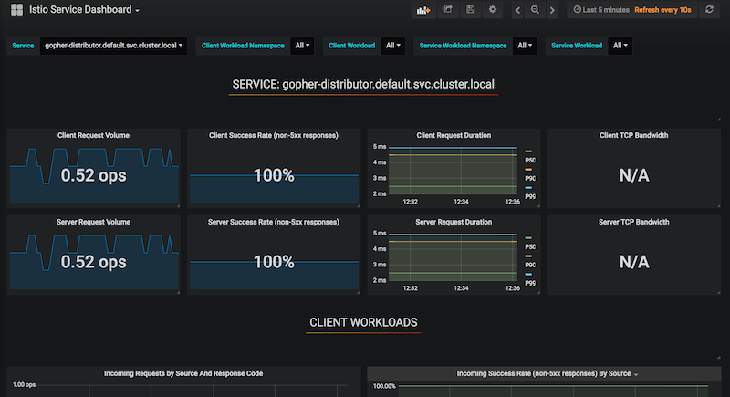

# Meshing around with Istio and Amazon EKS

It's time to have a play around with Istio and Amazon EKS. Amazon EKS went GA in 2018. However, at that time, EKS was missing support for dynamic admission controllers. This meant that a few additional steps had to be taken in order for Istio to be deployed correctly in to an EKS based Kubernetes cluster.

In October of this year support for Dynamic Admission Controllers was added to EKS. Let's take a look at if this new functionality simplified the process of deploying and operating Istio on EKS.

So, let's go!

## Create a Cluster Using eksctl

I'm going to start by creating a new EKS cluster. I'm happy to report that as of December 20th 2018 Amazon EKS is now supported in my home region on ap-southeast-2 (Sydney). I'll be creating my clusters in that region using the awseome command line tool eksctl.

``` command
eksctl create cluster --region ap-southeast-2
```

## Testing 1 ... 2 ... 3

After a few minutes, the EKS control plane and nodes should be up and running. Let's run a few simple tests to ensure that everything is looking healthy.

``` command
aws eks list-clusters --region ap-souteast-2
```

``` json
{
    "clusters": [
        "extravagant-monster-1545334691"
    ]
}
```

``` command

kubectl get nodes

```

``` command
NAME                                                STATUS    ROLES     AGE       VERSION
ip-192-168-38-190.ap-southeast-2.compute.internal   Ready     <none>    3m        v1.11.5
ip-192-168-93-109.ap-southeast-2.compute.internal   Ready     <none>    3m        v1.11.5
```

Looking good so far!

## Installing Helm

We're going to setup Istio within the EKS cluster using Helm[1], so for my next trick, I am going to install Helm in to my EKS cluster.

Begin by creating the service account required by the Tiller[2] service for doing stuff.

``` bash

kubectl create -f https://raw.githubusercontent.com/istio/istio/master/install/kubernetes/helm/helm-service-account.yaml

```

[1]: Helm is the package manager for Kubernetes. As an operating system package manager makes it easy to install tools on an OS, Helm makes it easy to install applications and resources into Kubernetes clusters.

[2]: Tiller is the in-cluster component of Helm. It interacts directly with the Kubernetes API server to install, upgrade, query, and remove Kubernetes resources. It also stores the objects that represent releases.

Next, we will initialise Helm within the EKS cluster using the serice account which we created earlier.

``` command
helm init --service-account tiller
```

Let's do a quick check to ensure that things were installed as expected

``` command
kubectl get pods --all-namespaces
```

You should expect to see a pod with a **NAME** that looks something like this **tiller-deploy-64ddd985c9-qcw2g**.

## Download the latest Istio release

Before we can install Istio, we need to download the Istio components. 

``` command
curl -L https://git.io/getLatestIstio | sh -
```

Switch to the newly created directory.

``` bash
cd istio-1.0.x
```

## Installing the custom resource definitions

Istio requires a number of customer resources[1] to be created within the Kubernetes API to support it's various modes of operation and features. We can use the pre-provided CRD[2] (Custom resource definitions) to create these custom resources within the Kubernetes API.

``` command
kubectl apply -f install/kubernetes/helm/istio/templates/crds.yaml
```

[1]: A custom resource is an object that extends the Kubernetes API or allows you to introduce your own API into a project or a cluster.

[2]: A custom resource definition (CRD) file defines your own object kinds and lets the API Server handle the entire lifecycle. Deploying a CRD into the cluster causes the Kubernetes API server to begin serving the specified custom resource.

## Installing Istio using Helm

In 2018 BDAC (Before Dynamic Admission Controllers) in order to sucesfully install and run Istio on EKS you need to disable some specific features using parameter flags. 

```sidecarInjectorWebhook.enabled=false``` and ```global.configValidation=false```

However, in 2018 ADAC (After Dynamic Admission Controllers) we can deloy simply, using the following command:

``` command
helm install install/kubernetes/helm/istio --name istio --namespace istio-system \
--set servicegraph.enabled=true \
--set tracing.enabled=true \
--set grafana.enabled=true
```

## Label the default namespace for sidecar injection 

In order for the automatic sidecar injection to function, we need to add some metadata to the Kubernetes namespace in to which we plan to deploy our pods. We'll use a simple label with the key "istio-injection" and the value "enabled".

``` command
kubectl label namespace default istio-injection=enabled
```

## Deploying the demo application

We're now all set to deploy our application. This particular demo application is made up of two discrete sevices. The **gopher-requester** and the **gopher-distrubutor**. 

### What does this application do?
Nothing special. When a call is made to the **gopher-requester**, using **curl** for example, that call is passed along to the **gopher-distributor**. The **gopher-distributor** constructs a response and sends it back along the calls stack.

Let's start with the **gopher-requester**

``` command
kubectl apply -f ../gopher-requester/deployment.yaml
```

And now the **gopher-distributor**

``` command
kubectl apply -f ../gopher-distributor/deployment.yaml
```

Once these pods have been deployed, you should be able to check if the sidecar container has been injected

``` command
kubectl get pods
```

The output should look something like this

``` command
NAME                                  READY     STATUS    RESTARTS   AGE
gopher-distributor-694fd4f4db-24csn   2/2       Running   0          1m
gopher-distributor-694fd4f4db-4hk9t   2/2       Running   0          1m
gopher-distributor-694fd4f4db-gnn4g   2/2       Running   0          1m
gopher-requester-7d5cbc7989-bw8zc     2/2       Running   0          52s
gopher-requester-7d5cbc7989-tw69r     2/2       Running   0          43s
gopher-requester-7d5cbc7989-whxcm     2/2       Running   0          36s
```

If you unpack one of those pods using some JQ-foo ...

```
kubectl get po/gopher-distributor-694fd4f4db-24csn -o json | jq '.spec.containers[].name'
```

... we should see that there are infact two containers running within the context of the pod. One for our core application, which in this case is our **gopher-distributor** and another, our Istio proxy sidecar (Envoy)

``` command
"gopher-distributor"
"istio-proxy"
```


## Laying down some ground rules

Before Istio can start doing anything useful for us, we need to tell it about our application and the services that make up our application. Let's start by creating **VirtualServices** (these are API resources) that represent out **gopher-requester** and **gopher-distribtor** services 

``` bash

cat <<EOF | kubectl apply -f -
apiVersion: networking.istio.io/v1alpha3
kind: Gateway
metadata:
  name: gopher-gateway
spec:
  selector:
    istio: ingressgateway # use Istio default gateway implementation
  servers:
  - port:
      number: 80
      name: http
      protocol: HTTP
    hosts:
    - "gopher-requester.default.svc.cluster.local"
---
apiVersion: networking.istio.io/v1alpha3
kind: VirtualService
metadata:
  name: gopher-requester-virtual-service
spec:
  hosts:
  - "*"
  gateways:
  - gopher-gateway
  http:
  - match:
    - uri:
        prefix: /
    route:
    - destination:
        host: gopher-requester.default.svc.cluster.local
        port:
          number: 80
---
apiVersion: networking.istio.io/v1alpha3
kind: VirtualService
metadata:
  name: gopher-distributor-virtual-service
spec:
  hosts:
  - gopher-distributor.default.svc.cluster.local
  http:
  - route:
    - destination:
        host: gopher-distributor.default.svc.cluster.local
        subset: v1
---
apiVersion: networking.istio.io/v1alpha3
kind: DestinationRule
metadata:
  name: gopher-distributor-route-rule
spec:
  host: gopher-distributor.default.svc.cluster.local
  subsets:
  - name: v1
    labels:
      version: v1
  - name: v2
    labels:
      version: v2
EOF

```

We should see some output confirming that our routing rules have been created. Sweet!

``` command

virtualservice.networking.istio.io "gopher-requester-virtual-service" created
virtualservice.networking.istio.io "gopher-distributor-virtual-service" created
destinationrule.networking.istio.io "gopher-distributor-route-rule" created

```

## Testing our application is responding

We'll use **curl** to make sure that we're getting a response back from our application.

``` command

curl $(kubectl get svc gopher-requester -o json | jq '.status.loadBalancer.ingress[0].hostname' | tr -d '"')

```

Hopeully we now see something like this:

``` command

Request >> Gopher Version 1 from pod gopher-distributor-694fd4f4db-gnn4g

```

Let's now open up another terminal emulator window or tab. We will use the following ```while``` statement to generate some traffic to our application.

``` bash

while true;do curl $(kubectl get svc istio-ingressgateway -n istio-system -o jsonpath='{.status.loadBalancer.ingress[0].hostname}');sleep 1;done

```

We should now be seeing a fairly even distribution of responses back from different instances of the **gopher-distributor** service running within the cluster.

``` command

Request >> Gopher Version 1 from pod gopher-distributor-694fd4f4db-gnn4g
Request >> Gopher Version 1 from pod gopher-distributor-694fd4f4db-4hk9t
Request >> Gopher Version 1 from pod gopher-distributor-694fd4f4db-24csn
Request >> Gopher Version 1 from pod gopher-distributor-694fd4f4db-gnn4g
Request >> Gopher Version 1 from pod gopher-distributor-694fd4f4db-4hk9t
Request >> Gopher Version 1 from pod gopher-distributor-694fd4f4db-24csn
Request >> Gopher Version 1 from pod gopher-distributor-694fd4f4db-gnn4g

```

## Dark Launch

Great, so now we have our application, Istio and some Istio rules that help route (amongst other things) our service calls.

Let's now experiment with a particularly cool feature of Istio called traffic mirroring. This feature lets us launch a new version of our service and mirror production traffic to it, without actually making it **live**.

We'll start by deploying a new version of our **gopher-distributor** service:

``` command

kubectl apply -f ../gopher-distributor-v2/deployment.yaml

```

Checking back in with our test call in the other terminal windoe/tab, we see everything looks pretty much normal. We are still getting responses from v1 of our distributor.

``` command

Request >> Gopher Version 1 from pod gopher-distributor-694fd4f4db-gnn4g
Request >> Gopher Version 1 from pod gopher-distributor-694fd4f4db-4hk9t
Request >> Gopher Version 1 from pod gopher-distributor-694fd4f4db-24csn
...
...

```

Let's now up the **VirtualService** for the **gopher-distributor** to include some traffic **mirror** magic. 

``` bash

cat <<EOF | kubectl apply -f -
apiVersion: networking.istio.io/v1alpha3
kind: VirtualService
metadata:
  name: gopher-distributor-virtual-service
spec:
  hosts:
  - gopher-distributor.default.svc.cluster.local
  http:
  - route:
    - destination:
        host: gopher-distributor.default.svc.cluster.local
        subset: v1
      weight: 100
    mirror:
        host: gopher-distributor.default.svc.cluster.local
        subset: v2
EOF

```

If we deconstruct the updated rule, all it's really saying is for 100 percent of requests to the hostname **gopher-distributor.default.svc.cluster.local** send requests to the v1 subset of that service, but also **mirror** the requests to the v2 subset (which is the version we just deployed). 

## Obervability included

Okay, so we've done that, but nothing really changed. How do we know traffic is actually going to v2? Enter Grafana. We instructed Istio to setup Grafana when we ran the helm Installer for Istio earlier.

We're going to tap in to the awesome port-forward function of **kubectl** to access the Grafana instance that Istio very kindly configured for us.

``` command

kubectl -n istio-system port-forward $(kubectl -n istio-system get pod -l app=grafana -o jsonpath='{.items[0].metadata.name}') 3000:3000 &

```

Once that's done, up your browser of choice and then navigate to the following URL:

[http://localhost:3000/d/1/istio-mesh-dashboard](http://localhost:3000/d/1/istio-mesh-dashboard)

You should now be able to see two instances of the **gopher-distributor** service. **v1** and **v2**.



The metrics should look pretty identical and that's down to the mirroring.

## The cutover

Okay, so now that we are happy that the new version of our **gopher-distributor** service is behaving, let's start an incremental cutover.

This next rule us going to update the gopher-distributor **VirtualServce** and split requests 50/50 between v1 and v2.

``` bash

cat <<EOF | kubectl apply -f -
apiVersion: networking.istio.io/v1alpha3
kind: VirtualService
metadata:
  name: gopher-distributor-virtual-service
spec:
  hosts:
  - gopher-distributor.default.svc.cluster.local
  http:
  - route:
    - destination:
        host: gopher-distributor.default.svc.cluster.local
        subset: v1
      weight: 50
    - destination:
        host: gopher-distributor.default.svc.cluster.local
        subset: v2
      weight: 50
EOF

```

If we check back in with our test call in the other emulator window/tab, we should now see something a little different. Roughly 50 percent of the responses are coming from the v2 instance of the **gopher-distributor** service:

``` command

Request >> Gopher Version 2 from pod gopher-distributor-v2-6d5887bb96-vzc4x (817b00a0b7cca7a5)
Request >> Gopher Version 1 from pod gopher-distributor-694fd4f4db-24csn
Request >> Gopher Version 2 from pod gopher-distributor-v2-6d5887bb96-xjh45 (4246faf2c16d238a)
Request >> Gopher Version 1 from pod gopher-distributor-694fd4f4db-gnn4g
Request >> Gopher Version 2 from pod gopher-distributor-v2-6d5887bb96-xcrxh (6f33515876dfa2eb)
Request >> Gopher Version 1 from pod gopher-distributor-694fd4f4db-24csn
...

```

**COOOL!**

Let's now wrap things up with a full cutover and send 100 percent of requests to the new v2 instance of the **gopher-distributor** service.

``` bash

cat <<EOF | kubectl apply -f -
apiVersion: networking.istio.io/v1alpha3
kind: VirtualService
metadata:
  name: gopher-distributor-virtual-service
spec:
  hosts:
  - gopher-distributor.default.svc.cluster.local
  http:
  - route:
    - destination:
        host: gopher-distributor.default.svc.cluster.local
        subset: v2
      weight: 100
EOF

```

You'll see all of responses are coming back from the new v2 instance of the **gopher-distributor** service.

``` command

Request >> Gopher Version 2 from pod gopher-distributor-v2-6d5887bb96-xcrxh (353130990d3d3bad)
Request >> Gopher Version 2 from pod gopher-distributor-v2-6d5887bb96-vzc4x (93ec1cdc162261e4)
Request >> Gopher Version 2 from pod gopher-distributor-v2-6d5887bb96-xjh45 (6986a4496f15c931)
Request >> Gopher Version 2 from pod gopher-distributor-v2-6d5887bb96-xcrxh (c6d4ab12d05ab45f)
Request >> Gopher Version 2 from pod gopher-distributor-v2-6d5887bb96-vzc4x (67d56a7d02b15803)
Request >> Gopher Version 2 from pod gopher-distributor-v2-6d5887bb96-xjh45 (c46eebd43f7eb07b)

```

## That's a wrap

As you can see, it's pretty easy to get Istio up and running within EKS. With the introduction of Dynamic Admission Controllers it got even easier to add you services in to the Istio service mesh. Istio offers a lot of really awesome features that remove so much of the heavy lifting that development teams traditionally had to do in order to monitor and operate complex distributed applications.